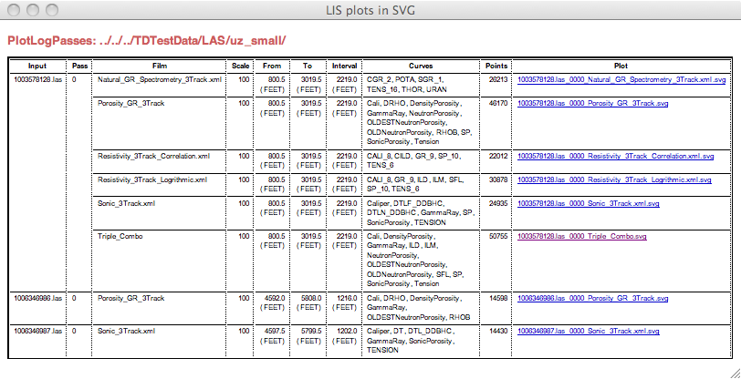

.. moduleauthor:: Paul Ross <apaulross@gmail.com>
.. sectionauthor:: Paul Ross <apaulross@gmail.com>

.. Description of command line tools at TotalDepth root level.

*****************************
TotalDepth Command Line Tools
*****************************

This describes the command line tools that are available for processing any TotalDepth file.

The tools are located in ``TotalDepth/``

.. list-table:: **LIS Command Line Tools**
    :widths: 20 60
    :header-rows: 1
    
    * - Tool Name
      - Description
    * - ``tdarchive``
      - Scans a directory of files and provides an analysis by file type. :ref:`Link <TotalDepth-cmdline-archive>`
    * - ``tdcopybinfiles``
      - Selects files of a particular type and copies them to a directory. This can also expand compressed archives. :ref:`Link <TotalDepth-cmdline-tdcopybinfiles>`
    * - ``tdremovedupefiles``
      - Removes duplicate files based on their checksum. :ref:`Link <TotalDepth-cmdline-tdremovedupefiles>`
    * - ``tddetif``
      - Removes TIF markers from a file. :ref:`Link <TotalDepth-cmdline-detif>`
    * - ``tdplotlogs``
      - Plots logs from LIS and LAS data. :ref:`Link <TotalDepth-cmdline-PlotLogs>`

.. _TotalDepth-cmdline-archive:

Analysing a Directory of Files with ``tdarchive``
=================================================

Scans a directory of files and provides an analysis by file type.

Usage
--------------

Usage::

    usage: tdarchive [-h] [--file-type FILE_TYPE] [-b BYTES] [-r]
                     [--expand-and-delete] [--histogram] [-n] [-o] [-l LOG_LEVEL]
                     [-v]
                     path [path_out]

Arguments
-------------------

#. The path to the input directory
#. [Optional] Path to the output directory to write the files to. The results are undefined if path_out conflicts with path_in.

Options
--------------------

+--------------------------------------+---------------------------------------------------------------------------------+
| Option                               | Description                                                                     |
+======================================+=================================================================================+
+--------------------------------------+---------------------------------------------------------------------------------+
| ``-h, --help``                       | Show this help message and exit.                                                |
+--------------------------------------+---------------------------------------------------------------------------------+
| ``--file-type``                      | Types of files to analyse, this option is is additive so can be used multiple   |
|                                      | times.                                                                          |
|                                      | Supported (and default) file types are:                                         |
|                                      | ASCII, LAS1.2, LAS2.0, LAS3.0, LIS, LISt, LIStr, PDF, PS, RP66V1, RP66V1t,      |
|                                      | RP66V1tr, RP66V2, SEGY, TIFF, XML, ZIP                                          |
+--------------------------------------+---------------------------------------------------------------------------------+
| ``-b, --bytes=``                     | The number of initial bytes of the file to show [default: 0].                   |
+--------------------------------------+---------------------------------------------------------------------------------+
| ``-r, --recursive``                  | Process input recursively. [default: False]                                     |
+--------------------------------------+---------------------------------------------------------------------------------+
| ``--expand-and-delete``              | Expand and delete archive files, implies ``--recurse``. [default: False]        |
+--------------------------------------+---------------------------------------------------------------------------------+
| ``--histogram``                      | Plot a histogram of file sizes. [default: False]                                |
+--------------------------------------+---------------------------------------------------------------------------------+
| ``-n, --nervous``                    | Nervous mode, does not do anything but report.                                  |
+--------------------------------------+---------------------------------------------------------------------------------+
| ``-o, --over-write``                 | Overwrite existing files, otherwise warns.                                      |
+--------------------------------------+---------------------------------------------------------------------------------+
| ``-l, --log-level=``                 | Log Level as an integer or symbol. (0<->NOTSET, 10<->DEBUG, 20<->INFO,          |
|                                      | 30<->WARNING, 40<->ERROR, 50<->CRITICAL) [default: 30]                          |
+--------------------------------------+---------------------------------------------------------------------------------+
| ``-v, --verbose``                    | Increase verbosity, additive [default: 0]                                       |
+--------------------------------------+---------------------------------------------------------------------------------+

Examples
-----------------

Here is an example of scanning the ``example_data`` directory (the output is filleted for clarity)::
    
    $ tdarchive example_data/ -r --histogram
    CMD: tdarchive example_data/ -r --histogram
    Analysing archive.
    Common prefix:
           108,707 .SVG       XML      example_data/LIS/Plot/DILLSON-1_WELL_LOGS_FILE-013.LIS_0001_HDT.svg
               667 .HTML      XML      example_data/LIS/Plot/index.html
           163,169 .SVG       XML      example_data/LIS/Plot/DILLSON-1_WELL_LOGS_FILE-037.LIS_0001_1.svg
               690 .CSS       ASCII    example_data/LIS/Plot/index.css
    ...
           184,084 .LIS       LIS      example_data/LIS/data/DILLSON-1_WELL_LOGS_FILE-037.LIS
            96,376 .LIS       LIS      example_data/LIS/data/DILLSON-1_WELL_LOGS_FILE-013.LIS
            98,508 .LIS       LIS      example_data/LIS/data/DILLSON-1_WELL_LOGS_FILE-049.LIS
            10,306 .PY        ASCII    example_data/RP66V1/demo_read.py
           462,795 .HTML      XML      example_data/RP66V1/HTML/206_05a-_3_DWL_DWL_WIRE_258276498.DLIS.HTML.html
             3,098 .HTML      XML      example_data/RP66V1/HTML/index.html
    ...
         1,018,327 .PKL                example_data/RP66V1/pickle/206_05a-_3_DWL_DWL_WIRE_258276498.pkl
           276,045 .PKL                example_data/RP66V1/pickle/206_05a-_3_DWL_DWL_WIRE_258276498.DLIS.pkl
               520 .PKL                example_data/RP66V1/pickle/MINIMAL_FILE.dlis.pkl
            53,137 .PKL                example_data/RP66V1/pickle/BASIC_FILE.dlis.pkl
               949 .PKL                example_data/RP66V1/pickle/BASIC_FILE_WITH_TWO_VISIBLE_RECORDS_NO_IFLRS.dlis.pkl
             7,731 .LAS       LAS2.0   example_data/RP66V1/LAS/BASIC_FILE_WITH_TWO_VISIBLE_RECORDS_NO_IFLRS_0_.las
         1,621,374 .LAS       LAS2.0   example_data/RP66V1/LAS/206_05a-_3_DWL_DWL_WIRE_258276498_0_800T.las
    ...
            44,916 .DLIS      RP66V1   example_data/RP66V1/data/BASIC_FILE.dlis
           540,372 .DLIS      RP66V1   example_data/RP66V1/data/206_05a-_3_DWL_DWL_WIRE_258276498.DLIS
               716 .DLIS      RP66V1   example_data/RP66V1/data/MINIMAL_FILE.dlis
             8,826 .DLIS      RP66V1   example_data/RP66V1/data/BASIC_FILE_WITH_TWO_VISIBLE_RECORDS_NO_IFLRS.dlis
    Total number of files 75, total bytes 12,981,766
    File extensions:
    .CSS  :        5
    .DLIS :        4
    .HTML :       13
    .LAS  :        6
    .LIS  :        3
    .PKL  :        5
    .PY   :        1
    .PYC  :        1
    .SVG  :       36
    .XML  :        1
    Binary file types:
    Binary type: ""
     Extensions: .PKL, .PYC
          Count: 6 [8.000%]
          Bytes: 1,354,629 [10.435%] from 520 to  1,018,327
    >=2**9  [     2] | ++++++++++++++++++++++++++++++++++++++++++++++++++++++++++++++++++++++++++++++++
    >=2**10 [     0] |
    >=2**11 [     0] |
    >=2**12 [     1] | ++++++++++++++++++++++++++++++++++++++++
    >=2**13 [     0] |
    >=2**14 [     0] |
    >=2**15 [     1] | ++++++++++++++++++++++++++++++++++++++++
    >=2**16 [     0] |
    >=2**17 [     0] |
    >=2**18 [     1] | ++++++++++++++++++++++++++++++++++++++++
    >=2**19 [     1] | ++++++++++++++++++++++++++++++++++++++++

    Binary type: "ASCII"
     Extensions: .CSS, .PY
          Count: 6 [8.000%]
          Bytes: 15,232 [0.117%] from 690 to  10,306
    >=2**9  [     4] | ++++++++++++++++++++++++++++++++++++++++++++++++++++++++++++++++++++++++++++++++
    >=2**10 [     0] |
    >=2**11 [     1] | ++++++++++++++++++++
    >=2**12 [     0] |
    >=2**13 [     1] | ++++++++++++++++++++

    Binary type: "LAS2.0"
     Extensions: .LAS
          Count: 6 [8.000%]
          Bytes: 1,785,653 [13.755%] from 1,279 to  1,621,374
    >=2**10 [     1] | ++++++++++++++++++++++++++++++++++++++++++++++++++++++++++++++++++++++++++++++++
    >=2**11 [     1] | ++++++++++++++++++++++++++++++++++++++++++++++++++++++++++++++++++++++++++++++++
    >=2**12 [     1] | ++++++++++++++++++++++++++++++++++++++++++++++++++++++++++++++++++++++++++++++++
    >=2**13 [     0] |
    >=2**14 [     0] |
    >=2**15 [     1] | ++++++++++++++++++++++++++++++++++++++++++++++++++++++++++++++++++++++++++++++++
    >=2**16 [     1] | ++++++++++++++++++++++++++++++++++++++++++++++++++++++++++++++++++++++++++++++++
    >=2**17 [     0] |
    >=2**18 [     0] |
    >=2**19 [     0] |
    >=2**20 [     1] | ++++++++++++++++++++++++++++++++++++++++++++++++++++++++++++++++++++++++++++++++

    Binary type: "LIS"
     Extensions: .LIS
          Count: 3 [4.000%]
          Bytes: 378,968 [2.919%] from 96,376 to  184,084
    >=2**16 [     2] | ++++++++++++++++++++++++++++++++++++++++++++++++++++++++++++++++++++++++++++++++
    >=2**17 [     1] | ++++++++++++++++++++++++++++++++++++++++

    Binary type: "RP66V1"
     Extensions: .DLIS
          Count: 4 [5.333%]
          Bytes: 594,830 [4.582%] from 716 to  540,372
    >=2**9  [     1] | ++++++++++++++++++++++++++++++++++++++++++++++++++++++++++++++++++++++++++++++++
    >=2**10 [     0] |
    >=2**11 [     0] |
    >=2**12 [     0] |
    >=2**13 [     1] | ++++++++++++++++++++++++++++++++++++++++++++++++++++++++++++++++++++++++++++++++
    >=2**14 [     0] |
    >=2**15 [     1] | ++++++++++++++++++++++++++++++++++++++++++++++++++++++++++++++++++++++++++++++++
    >=2**16 [     0] |
    >=2**17 [     0] |
    >=2**18 [     0] |
    >=2**19 [     1] | ++++++++++++++++++++++++++++++++++++++++++++++++++++++++++++++++++++++++++++++++

    Binary type: "XML"
     Extensions: .HTML, .SVG, .XML
          Count: 50 [66.667%]
          Bytes: 8,852,454 [68.191%] from 667 to  961,863
    >=2**9  [     1] | ++++
    >=2**10 [     1] | ++++
    >=2**11 [     2] | +++++++++
    >=2**12 [     2] | +++++++++
    >=2**13 [     0] |
    >=2**14 [     0] |
    >=2**15 [     3] | +++++++++++++
    >=2**16 [    16] | +++++++++++++++++++++++++++++++++++++++++++++++++++++++++++++++++++++++
    >=2**17 [    18] | ++++++++++++++++++++++++++++++++++++++++++++++++++++++++++++++++++++++++++++++++
    >=2**18 [     5] | ++++++++++++++++++++++
    >=2**19 [     2] | +++++++++

    Execution time: 0.067 (s)
             Files: 75 rate 1,113.2 (files/s)
             Bytes: 1,350 rate 20,038.5 (bytes/s)

.. _TotalDepth-cmdline-tdcopybinfiles:

Copying a Directory of Files with ``tdcopybinfiles``
==============================================================

Scans a directory of files and can copy particular file type to another directory.

Usage
--------------

Usage::

    usage: TotalDepth.RP66V1.util.CopyBinFiles.main
           [-h] [--file-types FILE_TYPES] [-m] [-n] [-l LOG_LEVEL]
           path_in path_out

Arguments
-------------------

#. The path to the input directory
#. Path to the output directory to write the files to. The results are undefined if path_out conflicts with path_in.

Options
--------------------

+--------------------------------------+---------------------------------------------------------------------------------+
| Option                               | Description                                                                     |
+======================================+=================================================================================+
+--------------------------------------+---------------------------------------------------------------------------------+
| ``-h, --help``                       | Show this help message and exit.                                                |
+--------------------------------------+---------------------------------------------------------------------------------+
| ``--file-type``                      | Types of files to copy, this option is is additive so can be used multiple      |
|                                      | times.                                                                          |
|                                      | Supported (and default) file types are:                                         |
|                                      | ASCII, LAS1.2, LAS2.0, LAS3.0, LIS, LISt, LIStr, PDF, PS, RP66V1, RP66V1t,      |
|                                      | RP66V1tr, RP66V2, SEGY, TIFF, XML, ZIP                                          |
|                                      | Use '?' or '??' to  see what file types are available                           |
+--------------------------------------+---------------------------------------------------------------------------------+
| ``-m, --move``                       | Move rather than copy, Irrelevant for files in ZIP archives which are always    |
|                                      | copied. [default: False]                                                        |
+--------------------------------------+---------------------------------------------------------------------------------+
| ``-n, --nervous``                    | Nervous mode, does not do anything but report.                                  |
+--------------------------------------+---------------------------------------------------------------------------------+
| ``-l, --log-level=``                 | Log Level as an integer or symbol. (0<->NOTSET, 10<->DEBUG, 20<->INFO,          |
|                                      | 30<->WARNING, 40<->ERROR, 50<->CRITICAL) [default: 30]                          |
+--------------------------------------+---------------------------------------------------------------------------------+

Examples
-----------------

To see what file types are supported use '?' and two dummy paths::

    $ tdcopybinfiles --file-types=? '' ''
    Cmd: tdcopybinfiles --file-types=?
    Binary file types supported: ASCII, LAS1.2, LAS2.0, LAS3.0, LIS, LISt, LIStr, PDF, PS, RP66V1, RP66V1t, RP66V1tr, RP66V2, SEGY, TIFF, XML, ZIP
    Execution time =    0.000 (S) 0 kb/s

To get the file type description as well use '??' and two dummy paths::

    $ tdcopybinfiles --file-types=?? '' ''
    Cmd: tdcopybinfiles --file-types=??
    Binary file types supported:
    ASCII    - American Standard Code for Information Interchange
    LAS1.2   - Canadian Well Logging Society Log ASCII Standard version 1.2
    LAS2.0   - Canadian Well Logging Society Log ASCII Standard version 2.0
    LAS3.0   - Canadian Well Logging Society Log ASCII Standard version 3.0
    LIS      - Schlumberger LIS-79 well logging format
    LISt     - Schlumberger LIS-79 well logging format with TIF markers
    LIStr    - Schlumberger LIS-79 well logging format with reversed TIF markers
    PDF      - Portable Document Format
    PS       - Postscript
    RP66V1   - American Petroleum Institute Recommended Practice 66 version 1
    RP66V1t  - American Petroleum Institute Recommended Practice 66 version 1 with TIF markers
    RP66V1tr - American Petroleum Institute Recommended Practice 66 version 1 with reversed TIF markers
    RP66V2   - American Petroleum Institute Recommended Practice 66 version 2
    SEGY     - Society of Exploration Geophysicists seismic format Y
    TIFF     - Tagged Image File Format
    XML      - eXtensible Markup Language
    ZIP      - ZIP Compressed Archive
    Execution time =    0.000 (S) 0 kb/s

.. _TotalDepth-cmdline-tdremovedupefiles:

Removing Duplicate Files with ``tdremovedupefiles``
==============================================================

Scans a directory of files and identifies duplicate files by their checksum.
It is **strongly recommended** to use ``-n`` (``--nervous``) first and look at the results before running this without ``-n`` which is potentially destructive.

Usage
--------------

Usage::

    usage: TotalDepth.RP66V1.util.RemoveDupeFiles.main [-h] [--version] [-k] [-v]
                                                       [-r] [-l LOG_LEVEL] [-n]
                                                       path_in

Arguments
-------------------

#. The path to the directory.

Options
--------------------

+--------------------------------------+---------------------------------------------------------------------------------+
| Option                               | Description                                                                     |
+======================================+=================================================================================+
+--------------------------------------+---------------------------------------------------------------------------------+
| ``-h, --help``                       | Show this help message and exit.                                                |
+--------------------------------------+---------------------------------------------------------------------------------+
| ``-r, --recursive``                  | Process input recursively. [default: False]                                     |
+--------------------------------------+---------------------------------------------------------------------------------+
| ``-n, --nervous``                    | Nervous mode, does not do anything but report [default: False].                 |
+--------------------------------------+---------------------------------------------------------------------------------+
| ``-l, --log-level=``                 | Log Level as an integer or symbol. (0<->NOTSET, 10<->DEBUG, 20<->INFO,          |
|                                      | 30<->WARNING, 40<->ERROR, 50<->CRITICAL) [default: 20]                          |
+--------------------------------------+---------------------------------------------------------------------------------+
| ``-v, --verbose``                    | Increase verbosity, additive [default: 0]                                       |
+--------------------------------------+---------------------------------------------------------------------------------+

.. _TotalDepth-cmdline-detif:

Removing TIF Markers From Files with ``tddetif``
=================================================

Scans a directory of files and removes TIF markers.
TIF markers are 12 bytes of data inserted in various places.
They are not part of any standard and, except for one case, provide no value.
This tool rewrites the input file without TIF markers if they are found.

Usage
--------------

Usage::

    usage: tddetif [-h] [-r] [-n]
          [-l LOG_LEVEL] [-v] [-o]
          path_in [path_out]

Arguments
-------------------

#. The path to the input directory
#. Path to the output directory to write the files to. The results are undefined if path_out conflicts with path_in.

Options
--------------------

+--------------------------------------+---------------------------------------------------------------------------------+
| Option                               | Description                                                                     |
+======================================+=================================================================================+
+--------------------------------------+---------------------------------------------------------------------------------+
| ``-h, --help``                       | Show this help message and exit.                                                |
+--------------------------------------+---------------------------------------------------------------------------------+
| ``-r, --recurse``                    | Process input recursively. [default: False]                                     |
+--------------------------------------+---------------------------------------------------------------------------------+
| ``-n, --nervous``                    | Nervous mode, does not do anything but report [default: False].                 |
+--------------------------------------+---------------------------------------------------------------------------------+
| ``-l, --log-level=``                 | Log Level as an integer or symbol. (0<->NOTSET, 10<->DEBUG, 20<->INFO,          |
|                                      | 30<->WARNING, 40<->ERROR, 50<->CRITICAL) [default: 30]                          |
+--------------------------------------+---------------------------------------------------------------------------------+
| ``-v, --verbose``                    | Increase verbosity, additive [default: 0]                                       |
+--------------------------------------+---------------------------------------------------------------------------------+
| ``-o, --over-write``                 | Overwrite existing files if found, otherwise warns of existing target file.     |
+--------------------------------------+---------------------------------------------------------------------------------+

Examples
-----------------

todo::
    
    Put examples here.

These command line tools plot wireline data.

.. _TotalDepth-cmdline-PlotLogs:

Plotting Well Logs with ``tdplotlogs``
======================================

Produces SVG plots from LIS and LAS files.

Usage
--------------

Usage::

    usage: tdplotlogs [-h] [--version] [-j JOBS] [-k] [-l LOGLEVEL] [-g] [-r]
                       [-A] [-x LGFORMAT] [-X LGFORMAT_MIN] [-s SCALE]
                       in out

Arguments
-------------------

These are required arguments unless ``-h`` or ``--version`` options are specified (in which case no processing is done):

#. The path to the input LAS or LIS file or directory thereof.
#. The path to the output SVG file or directory, any directories will be created as necessary.

Options
--------------------

+--------------------------------------+---------------------------------------------------------------------------------+
| Option                               | Description                                                                     |
+======================================+=================================================================================+
| ``--version``                        | Show program's version number and exit                                          |
+--------------------------------------+---------------------------------------------------------------------------------+
| ``-h, --help``                       | Show this help message and exit.                                                |
+--------------------------------------+---------------------------------------------------------------------------------+
| ``-j JOBS, --jobs=JOBS``             | Max processes when multiprocessing. Zero uses number of native CPUs [8].        |
|                                      | -1 disables multiprocessing. [default: -1]                                      |
+--------------------------------------+---------------------------------------------------------------------------------+
| ``-k, --keep-going``                 | Keep going as far as sensible. [default: False]                                 |
+--------------------------------------+---------------------------------------------------------------------------------+
| ``-l LOGLEVEL, --loglevel=LOGLEVEL`` | Log Level (debug=10, info=20, warning=30, error=40, critical=50) [default: 20]  |
+--------------------------------------+---------------------------------------------------------------------------------+
| ``-g, --glob``                       | File pattern match. [default none]                                              |
+--------------------------------------+---------------------------------------------------------------------------------+
| ``-r, --recursive``                  | Process input recursively. [default: False]                                     |
+--------------------------------------+---------------------------------------------------------------------------------+
| ``-A, --API``                        | Put an API header on each plot. [default: False]                                |
+--------------------------------------+---------------------------------------------------------------------------------+
| ``-x LGFORMAT, --xml LGFORMAT``      | Use XML LgFormat UniqueId to use for plotting (additive). Use -x? to see what   |
|                                      | LgFormats (UniqueID+Description) are available.                                 |
|                                      | Use -x?? to see what curves each format can plot.                               |
|                                      | See also -X.                                                                    |
|                                      | This is additive so can used multiple times to get multiple plots from the      |
|                                      | same data.                                                                      |
+--------------------------------------+---------------------------------------------------------------------------------+
| ``-X LGFORMAT_MIN,``                 | Use all available LgFormat XML plots that use LGFORMAT_MIN or more outputs.     |
| ``--XML LGFORMAT_MIN``               | If -x option present limited by those LgFormats [default: 0]                    |
+--------------------------------------+---------------------------------------------------------------------------------+
| ``-s SCALE, --scale SCALE``          | Scale of X axis to use (an integer). This overrides the scale(s)                |
|                                      | specified in the LgFormat file or FILM table. [default: 0].                     |
+--------------------------------------+---------------------------------------------------------------------------------+

Examples
-----------------

LgFormat XML
^^^^^^^^^^^^^^^^^^^^^^^^^^^^^^^^^^

Using ``-x?`` to see what formats are available::

    $ python3 tdplotlogs -x? spam eggs
    
The output is something like::

    Cmd: tdplotlogs -x? spam eggs
    XML LgFormats available: [29]
    UniqueId                              Description
    -----------------------------------   --------------------------------
    ADN_Image_Format                    : ADN Image Log
    Azimuthal_Density_3Track.xml        : Azimuthal Density 3Track
    Azimuthal_Resistivity_3Track.xml    : Azimuthal Resistivity 3Track
    Blank_3Track_Depth                  : Blank 3Track
    Blank_3Track_Time.xml               : Blank 3Track Time
    FMI_IMAGE_ALIGNED                   : FMI Image Aligned
    FMI_IMAGE_PROCESSED                 : FMI Image Processed
    Formation_Test                      : Formation Test Time
    HDT                                 : High Definition Dipmeter
    Micro_Resistivity_3Track.xml        : Micro Resistivity 3 Track Format
    Natural_GR_Spectrometry_3Track.xml  : Natural GR Spectrometry 3Track
    OBMI_IMAGE_EQUAL                    : OBMI Image Equalized
    Porosity_GR_3Track                  : Standard Porosity Curves
    Pulsed_Neutron_3Track.xml           : Pulsed Neutron 3Track
    Pulsed_Neutron_Time.xml             : Pulsed Neutron Time
    RAB_Image_Format_Deep               : Resistivity At the Bit Image
    RAB_Image_Format_Medium             : Resistivity At the Bit Image
    RAB_Image_Format_Shallow            : Resistivity At the Bit Image
    RAB_Std_Format                      : Resistivity At the Bit
    Resistivity_3Track_Correlation.xml  : Resistivity Linear Correlation Format
    Resistivity_3Track_Logrithmic.xml   : Logrithmic Resistivity 3Track
    Resistivity_Investigation_Image.xml : AIT Radial Investigation Image
    Sonic_3Track.xml                    : Sonic DT Porosity 3 Track
    Sonic_PWF4                          : SONIC Packed Waveform 4
    Sonic_SPR1_VDL                      : SONIC Receiver Array Lower Dipole VDL
    Sonic_SPR2_VDL                      : SONIC Receiver Array Upper Dipole VDL
    Sonic_SPR3_VDL                      : SONIC Receiver Array Stonely VDL
    Sonic_SPR4_VDL                      : SONIC Receiver Array P and S VDL
    Triple_Combo                        : Resistivity Density Neutron GR 3Track Format

The first column is the UniqueID to be used in identifying plots for the ``-x`` option.

Using ``-x??`` to see what formats and what curves would be plotted by each plot specification::

    $ python3 tdplotlogs -x?? a b
    
The output is something like::

    Cmd: tdplotlogs -x?? a b    
    XML LgFormats available: [29]
    UniqueId                              Description
    -----------------------------------   --------------------------------
    ADN_Image_Format                    : ADN Image Log
        DRHB, GR  , GR_RAB, ROBB, ROP5, TNPH
    Azimuthal_Density_3Track.xml        : Azimuthal Density 3Track
        BS  , DCAL, DRHB, DRHL, DRHO, DRHR, DRHU, DTAB, HDIA, PEB , PEF , PEL 
        PER , PEU , RHOB, ROBB, ROBL, ROBR, ROBU, ROP5, RPM , SCN2, SOAB, SOAL
        SOAR, SOAU, SONB, SOXB, VDIA
    Azimuthal_Resistivity_3Track.xml    : Azimuthal Resistivity 3Track
        AAI , BS  , C1  , C2  , CALI, GR  , GRDN_RAB, GRLT_RAB, GRRT_RAB, GRUP_RAB, PCAL, RDBD
        RDBL, RDBR, RDBU, RLA0, RLA1, RLA2, RLA3, RLA4, RLA5, RMBD, RMBL, RMBR
        RMBU, ROP5, RPM , RSBD, RSBL, RSBR, RSBU, SP  , TENS
    Blank_3Track_Depth                  : Blank 3Track
    Blank_3Track_Time.xml               : Blank 3Track Time
    FMI_IMAGE_ALIGNED                   : FMI Image Aligned
        C1  , C2  , GR  , HAZIM, P1AZ, SP  , TENS
    FMI_IMAGE_PROCESSED                 : FMI Image Processed
        C1  , C2  , GR  , HAZIM, P1AZ, SP  , TENS
    Formation_Test                      : Formation Test Time
        B1TR, BFR1, BQP1, BQP1, BQP1, BQP1, BSG1, POHP
    HDT                                 : High Definition Dipmeter
        C1  , C2  , DEVI, FC0 , FC1 , FC2 , FC3 , FC4 , GR  , HAZI, P1AZ, RB  
    Micro_Resistivity_3Track.xml        : Micro Resistivity 3 Track Format
        BMIN, BMNO, BS  , CALI, GR  , HCAL, HMIN, HMNO, MINV, MLL , MNOR, MSFL
        PROX, RXO , SP  , TENS
    Natural_GR_Spectrometry_3Track.xml  : Natural GR Spectrometry 3Track
        CGR , PCAL, POTA, ROP5, SGR , SIGM, TENS, THOR, URAN
    OBMI_IMAGE_EQUAL                    : OBMI Image Equalized
        C1  , C1_OBMT, C2  , C2_OBMT, GR  , HAZIM, OBRA3, OBRB3, OBRC3, OBRD3, P1AZ, P1NO_OBMT
        TENS
    Porosity_GR_3Track                  : Standard Porosity Curves
        APDC, APLC, APSC, BS  , C1  , C2  , CALI, CALI_CDN, CMFF, CMRP, DPHB, DPHI
        DPHZ, DPOR_CDN, DRHO, ENPH, GR  , HCAL, NPHI, NPOR, PCAL, RHOB, RHOZ, ROP5
        SNP , SP  , SPHI, TENS, TNPB, TNPH, TNPH_CDN, TPHI
    Pulsed_Neutron_3Track.xml           : Pulsed Neutron 3Track
        FBAC, GR  , INFD, SIGM, TAU , TCAF, TENS, TPHI, TSCF, TSCN
    Pulsed_Neutron_Time.xml             : Pulsed Neutron Time
        FBAC_SL, GR_SL, INFD_SL, SIGM_SL, TAU_SL, TCAF_SL, TENS_SL, TPHI_SL, TSCF_SL, TSCN_SL
    RAB_Image_Format_Deep               : Resistivity At the Bit Image
        GR_RAB, RES_BD, RES_BM, RES_BS, RES_RING, ROP5
    RAB_Image_Format_Medium             : Resistivity At the Bit Image
        GR_RAB, RES_BD, RES_BM, RES_BS, RES_RING, ROP5
    RAB_Image_Format_Shallow            : Resistivity At the Bit Image
        GR_RAB, RES_BD, RES_BM, RES_BS, RES_RING, ROP5
    RAB_Std_Format                      : Resistivity At the Bit
        AAI , BDAV, BDM3, BMAV, BMM2, BSAV, BSM1, BTAB, CALI, DEVI, GR_RAB, HAZI
        OBIT, RBIT, RING, ROP5, RPM , RTAB
    Resistivity_3Track_Correlation.xml  : Resistivity Linear Correlation Format
        AHT20, AHT60, AHT90, ATR , BS  , CALI, CATR, CILD, CLLD, GR  , HCAL, ILD 
        ILM , LLD , LLS , MSFL, PCAL, PSR , RLA0, ROP5, RT  , RXO , SFL , SP  
        TENS
    Resistivity_3Track_Logrithmic.xml   : Logrithmic Resistivity 3Track
        A22H, A34H, AHF10, AHF20, AHF30, AHF60, AHF90, AHO10, AHO20, AHO30, AHO60, AHO90
        AHT10, AHT20, AHT30, AHT60, AHT90, ATR , BS  , CALI, GR  , HCAL, ILD , ILM 
        LLD , LLM , MSFL, P16H_RT, P28H_RT, P34H_RT, PCAL, PSR , RLA0, RLA1, RLA2, RLA3
        RLA4, RLA5, ROP5, RXO , SFL , SP  , TENS
    Resistivity_Investigation_Image.xml : AIT Radial Investigation Image
        AHT10, AHT20, AHT30, AHT60, AHT90, BS  , GR  , HCAL, SP  
    Sonic_3Track.xml                    : Sonic DT Porosity 3 Track
        BS  , CALI, DT  , DT0S, DT1R, DT2 , DT2R, DT4S, DTBC, DTCO, DTCU, DTL 
        DTLF, DTLN, DTR2, DTR5, DTRA, DTRS, DTSH, DTSM, DTST, DTTA, GR  , HCAL
        PCAL, ROP5, SP  , SPHI, TENS
    Sonic_PWF4                          : SONIC Packed Waveform 4
        CALI, DT1 , DT2 , DTCO, DTSM, DTST, GR  , HCAL, TENS
    Sonic_SPR1_VDL                      : SONIC Receiver Array Lower Dipole VDL
        CALI, DT1 , DT1 , DT2 , DTCO, DTSM, DTST, GR  , HCAL, TENS
    Sonic_SPR2_VDL                      : SONIC Receiver Array Upper Dipole VDL
        CALI, DT1 , DT2 , DT2 , DTCO, DTSM, DTST, GR  , HCAL, TENS
    Sonic_SPR3_VDL                      : SONIC Receiver Array Stonely VDL
        CALI, DT1 , DT2 , DT3R, DTCO, DTSM, DTST, GR  , HCAL, TENS
    Sonic_SPR4_VDL                      : SONIC Receiver Array P and S VDL
        CALI, DT1 , DT2 , DTCO, DTRP, DTRS, DTSM, DTST, GR  , HCAL, TENS
    Triple_Combo                        : Resistivity Density Neutron GR 3Track Format
        AHT10, AHT20, AHT30, AHT60, AHT90, APDC, APLC, APSC, ATR , BS  , C1  , C2  
        CALI, CMFF, CMRP, DPHB, DPHI, DPHZ, DPOR_CDN, DSOZ, ENPH, GR  , HCAL, HMIN
        HMNO, ILD , ILM , LLD , LLM , MSFL, NPHI, NPOR, PCAL, PEFZ, PSR , RLA0
        RLA1, RLA2, RLA3, RLA4, RLA5, ROP5, RSOZ, RXO , RXOZ, SFL , SNP , SP  
        SPHI, TENS, TNPB, TNPH, TNPH_CDN, TPHI

Plotting Logs
^^^^^^^^^^^^^^^^^^^^^^^^^^^^^^^^^^

Here is an example of plotting LIS and LAS files in directory ``in/`` with the plots in directory ``out/``. The following options have been invoked:

* API headers on the top of each plot: ``-A``
* Multiprocessing on with 4 simultaneous jobs: ``-j4``
* Recursive search of input directory: ``-r``
* Uses any available plot specifications from LgFormat XML files which result in 4 curves or more being plotted: ``-X 4``

The command line is::

    $ python3 tdplotlogs -A -j4 -r -X 4 in/ out/

First tdplotlogs echos the command::

    Cmd: tdplotlogs -A -j4 -r -X 4 in/ out/

When complete tdplotlogs writes out a summary, first the number of files read (output is wrapped here with '\\' for clarity)::

    plotLogInfo PlotLogInfo <__main__.PlotLogInfo object at 0x101e0da90> \
        Files=23 \
        Bytes=10648531 \
        LogPasses=23 \
        Plots=8 \
        Curve points=229991

Then as summary of each plot in detail (output is wrapped here with '\\' for clarity)::

    ('in/1003578128.las', \
        0, \
        'Natural_GR_Spectrometry_3Track.xml', \
        IndexTableValue( \
            scale=100, \
            evFirst='800.5 (FEET)', \
            evLast='3019.5 (FEET)', \
            evInterval='2219.0 (FEET)', \
            curves='CGR_2, POTA, SGR_1, TENS_16, THOR, URAN', \
            numPoints=26213, \
            outPath='out//1003578128.las_0000_Natural_GR_Spectrometry_3Track.xml.svg' \
        )
    )
    ('in/1003578128.las', \
        0, \
        'Porosity_GR_3Track', \
        IndexTableValue( \
            scale=100, \
            evFirst='800.5 (FEET)', \
            evLast='3019.5 (FEET)', \
            evInterval='2219.0 (FEET)', \
            curves='Cali, DRHO, DensityPorosity, GammaRay, NeutronPorosity, OLDESTNeutronPorosity, OLDNeutronPorosity, RHOB, SP, SonicPorosity, Tension', \
            numPoints=46170, \
            outPath='out//1003578128.las_0000_Porosity_GR_3Track.svg' \
        )
    )
    
    ... 8<------------- Snip ------------->8
    
    ('in/1006346987.las', \
        0, 'Sonic_3Track.xml', \
        IndexTableValue(
            scale=100, \
            evFirst='4597.5 (FEET)', \
            evLast='5799.5 (FEET)', \
            evInterval='1202.0 (FEET)', \
            curves='Caliper, DT, DTL_DDBHC, GammaRay, SonicPorosity, TENSION', \
            numPoints=14430, \
            outPath='out//1006346987.las_0000_Sonic_3Track.xml.svg' \
        )
    )

The fields in each tuple are:

* Input file name.
* LogPass number in the file. For example "Repeat Section" might be 0 and "Main Log" 1.
* LgFormat used for the plot (several plots my be generated from one LogPass).
* An IndexTableValue object (used to generate the index.html file) that has the following fields:
    * Plot scale as an integer.
    * First reading and units as an Engineering Value.
    * Last reading and units as an Engineering Value.
    * Log interval and units as an Engineering Value.
    * List of curve names plotted.
    * Total number of data points plotted.
    * The ouput file.

Finally the total number of curve feet plotted and the time it took::

    Interval*curves: EngVal: 121020.000 (FEET)
      CPU time =    0.043 (S)
    Exec. time =   25.119 (S)
    Bye, bye!

In this case (under Unix) the "CPU Time" is the cumulative amount of CPU time used. As we are using multiprocessing it is the CPU time of the parent process which is very small since it just invokes child processes. The Exec. time is the wall clock time between starting and finishing tdplotlogs.

In the output directory will be an index.html file that has a table with the fields that duplicate those on the command line output. It looks like this:

The links in the last column are to the SVG plots. Her is a screen shot of one:

.. image:: images/PlotLogsPlotExample.png

Sample Plots
^^^^^^^^^^^^^^^^^^^

Here is an actual plot from a `LAS file <../_static/plots/Triple_Combo_46_LAS.svg>`_ and there are many more examples here: :ref:`TotalDepth-examples-plots`.

