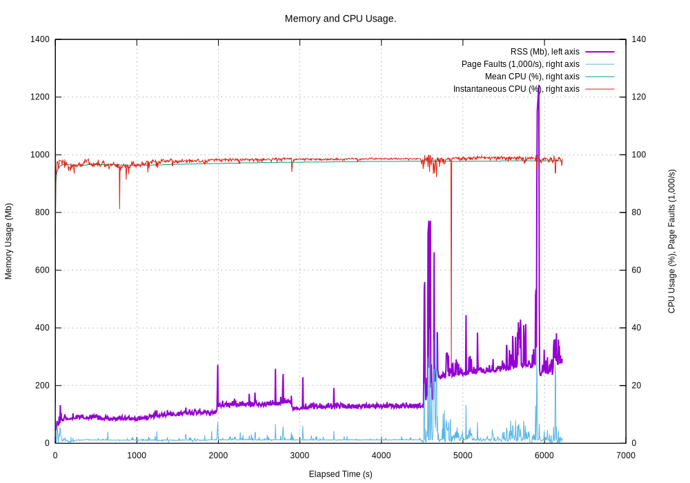

.. moduleauthor:: Paul Ross <apaulross@gmail.com>
.. sectionauthor:: Paul Ross <apaulross@gmail.com>

.. Technical Note on LIS frame read performance.

.. toctree::
    :maxdepth: 2
   
.. _TotalDepth-tech-LAS_read_perf:

************************************
LAS Performance
************************************

Reading LAS Files
========================

Here is the execution time of reading LAS files with ``TotalDepth.LAS.ReadLASFiles`` as a single process on 23,000+ real world LAS files totalling 35+Gb, 170+m frames and 2.8+ billion data points. Success rate was >98%. Largest file was 260 Mb:

.. image:: images/ReadLASFiles.svg
    :align: center
    :width: 500px
    :target: images/ReadLASFiles.svg

The overall performance is asymptotic to 180 ms/MB.

The memory usage of doing this follows this pattern:

