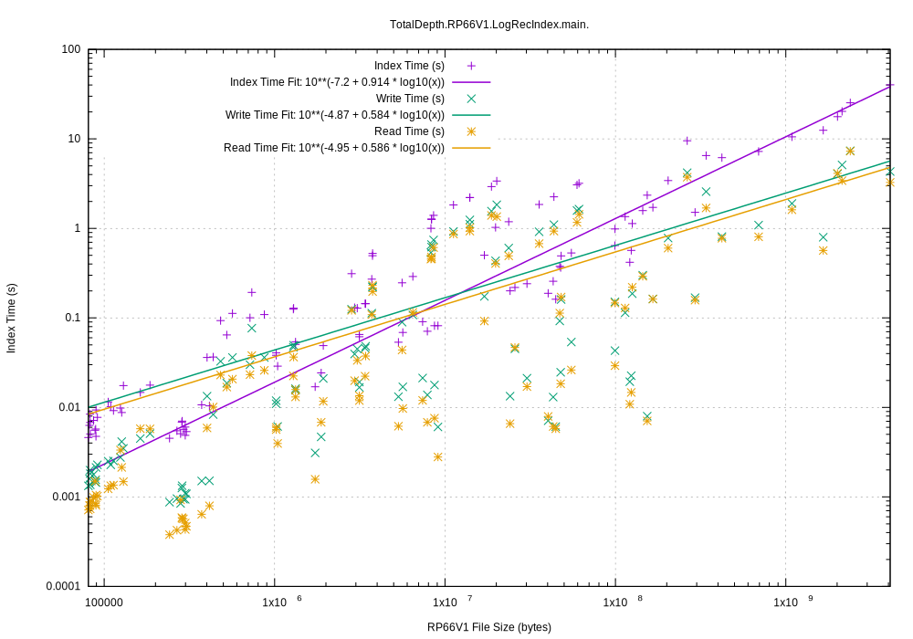
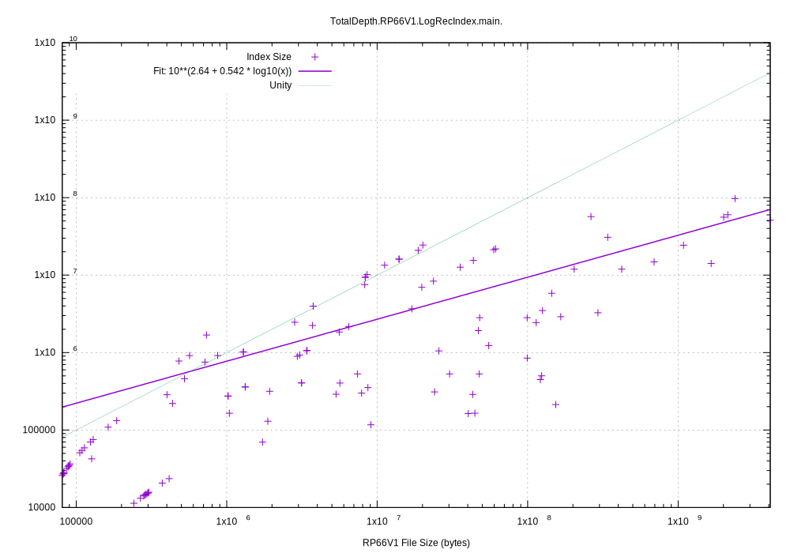
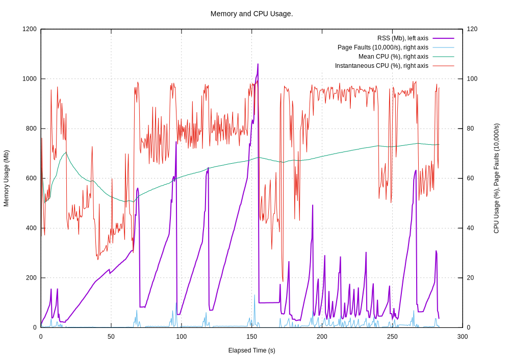
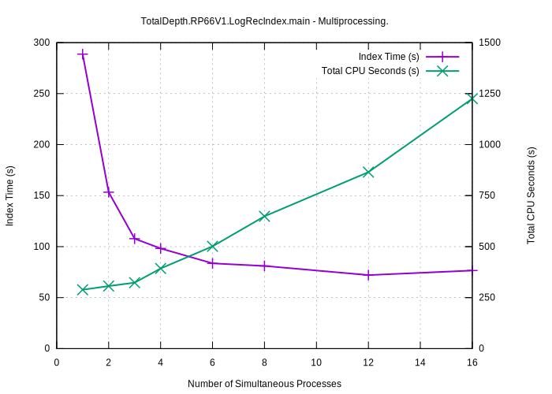
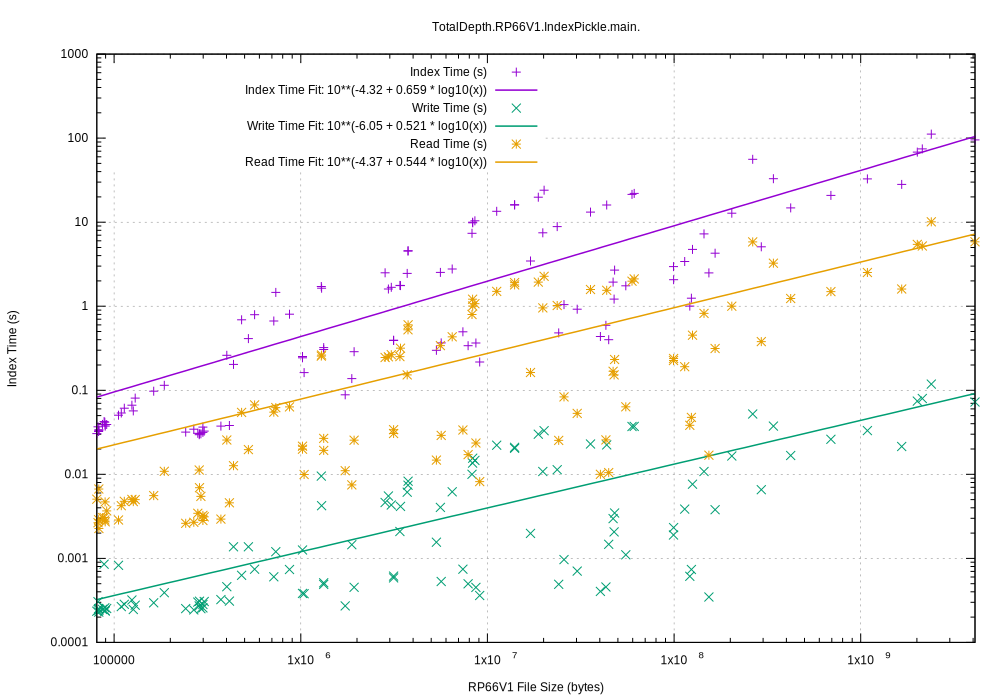
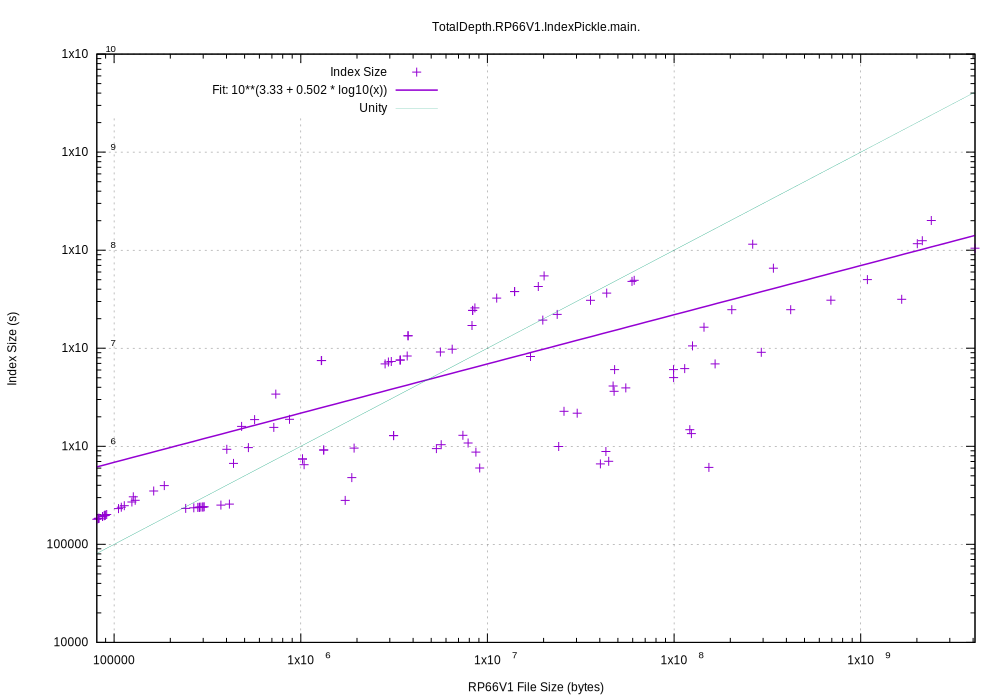
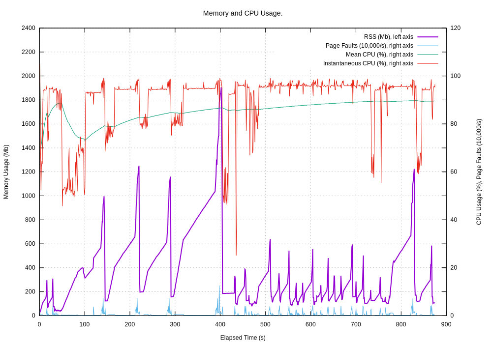
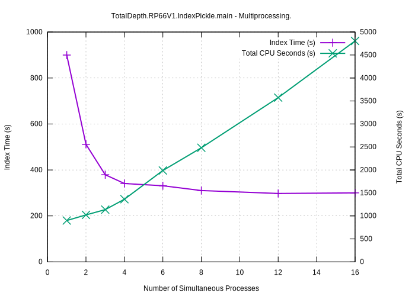

.. moduleauthor:: Paul Ross <apaulross@gmail.com>
.. sectionauthor:: Paul Ross <apaulross@gmail.com>

.. Technical Note on RP66V1 Indexing.

.. toctree::
    :maxdepth: 2
   
.. _TotalDepth-tech--RP66V1_indexing:

Indexing RP66V1 Files
================================

This describes how RP66V1 binary files are indexed to provide random access to any part of their data structure.
This also describes the performance of TotalDepth indexing a test set of around 100+ files that ranged in size from 80kb to 4GB totalling 17GB.
The average file size was about 150Mb.
These tests were run on a 2.7 GHz Intel Core i7 machine with 4 cores and hyper-threading.
This data refers to version 0.3.0 and may not be relavent to the current version, |version|.

Low-Level Index
--------------------

There are multiple levels of a RP66V1 index in TotalDepth, the lowest being a simple index of the start of every Logical Record.
The index is implemented by :py:class:`TotalDepth.RP66V1.core.pIndex.LogicalRecordIndex`

There is one entry on the index for each Logical Record and the  entry consists of:

* Integer absolute file position of the immediately prior Visible Record.
* Integer absolute file position of the first Logical Record Segment Header.
* One byte value of the first Logical Record Segment Header attributes.
* One byte value of the first Logical Record Segment Header type.
* Integer length of the Logical Data.

The following performance data was gathered by :py:mod:`TotalDepth.RP66V1.LogRecIndex`.
The performance is assessed by:

* The time it takes to index the file, persist it and read it back.
* The size of the persistent index.
* Memory usage.
* The value of multi-processing.

Execution Time
^^^^^^^^^^^^^^^^^^^^^^^^^

Here is the execution time(s) for creating, persisting and reading back the persisted index compared to RP66V1 files size:

While there is quite a variation by a factor of 10 the *average* *asymptotic* execution time trends to:

* Create the index: 10.6 ms/Mb
* Persist the index: 2.4 ms/Mb
* Read the persistent index: 2.1 ms/Mb

Index Size
^^^^^^^^^^^^^^^^^^^^^^^^^

The pickled index size compared to the original file size is shown here.
The green line shows where the index size would be equal to the input file size:

This index size trends to around 10% of the file size.
The large size of the index reflects to cost of Python's general purpose pickle protocol.
Each entry takes about 160 bytes whereas the C/C++ implementation  takes only around 24 bytes.

Memory and CPU Usage
^^^^^^^^^^^^^^^^^^^^^^^^^

Indexing the test set makes this memory and CPU demands:

The extra spikes at the end of indexing are due to Python's pickle module that pickles in-memory (even if pickling to a file).

The current version, |version|, this index is implemented in pure Python but in a future release the C/C++ indexer will be used.
This is far faster and has a much smaller persistent index.

Multiprocessing
^^^^^^^^^^^^^^^^^^^^^^^

Each index is independent so multi-processing can speed up index creation enormously.
The number of simultaneous processes can be specified with the ``--jobs=`` option.
Here is the same test data set being indexed including pickling the index to disk with a different number of simultaneous processes.

As expected beyond four processes the improvement is marginal.

Mid-Level Index
------------------

The mid-level index wraps up the low-level index with richer information and is one that the user normally interacts with.

The additional information it contains is:

* Every :term:`RP66V1.Explicitly Formatted Logical Record` (EFLR) as a full internal representation.
* A reference to every :term:`RP66V1.Indirectly Formatted Logical Record` (IFLR) as a partial internal representation. This does not contain the entire IFLR but does have each X axis value.

Naturally enough this index takes longer to build and uses more memory (and more disc space when persisted).

The index is implemented by :py:class:`TotalDepth.RP66V1.core.LogicalFile.LogicalIndex`
The following performance data was gathered by :py:mod:`TotalDepth.RP66V1.IndexPickle`.

Execution Time
^^^^^^^^^^^^^^^^^^^^^^^^^

Firstly time to create, persist and read back the persisted index:

While there is quite a variation by a factor of 10 the *average* *asymptotic* execution time trends to:

* Create the index: 42 ms/Mb (this includes the low level index of 10.6 ms/Mb).
* Persist the index: 0.07 ms/Mb (this seems remarkably small).
* Read the persistent index: 4 ms/Mb

Index Size
^^^^^^^^^^^^^^^^^^^^^^^^^

The index is roughly twice the size of the low-level index (although that ratio will increase dramatically when the C/C++ low-level index  code is merged).

Memory and CPU Usage
^^^^^^^^^^^^^^^^^^^^^^^^^

Indexing the test set makes this memory and CPU demands:

Multiprocessing
^^^^^^^^^^^^^^^^^^^^^^^

Here is the same test data set being indexed including pickling the index to disk with a different number of simultaneous processes.

Because the I/O is so much higher the improvement is more limited, at best x3 faster with 4 cores but still useful.
