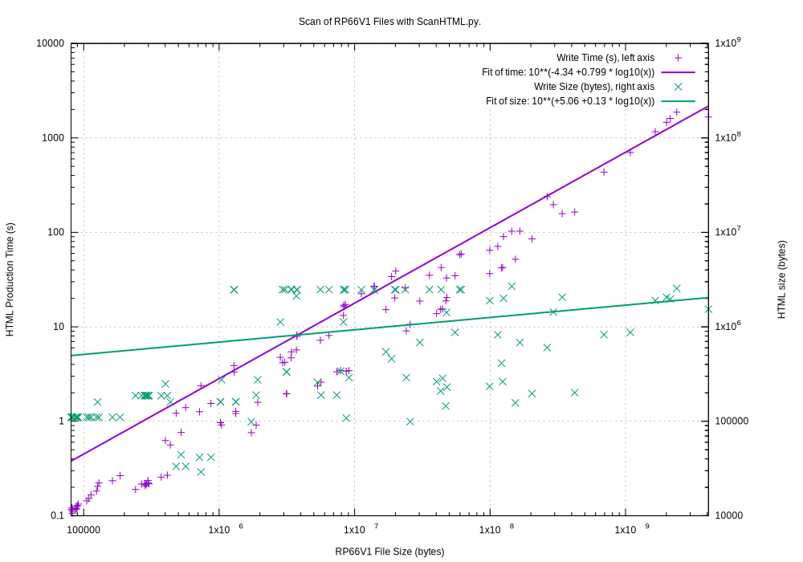
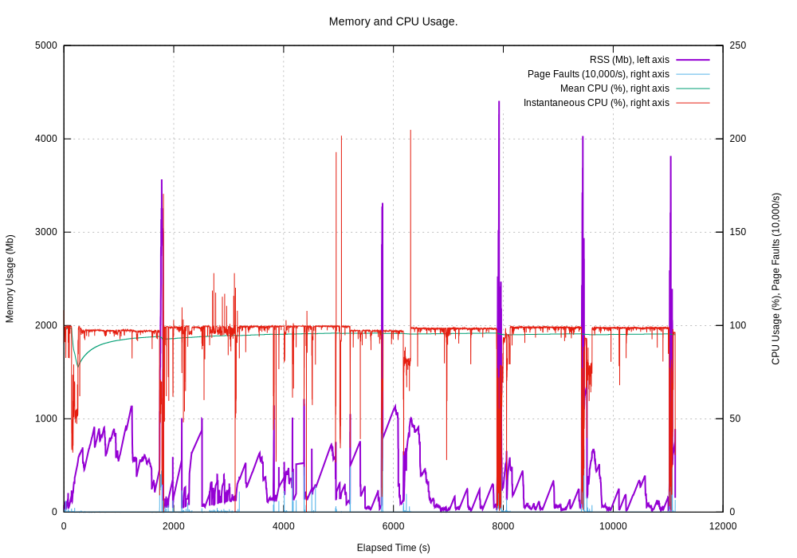
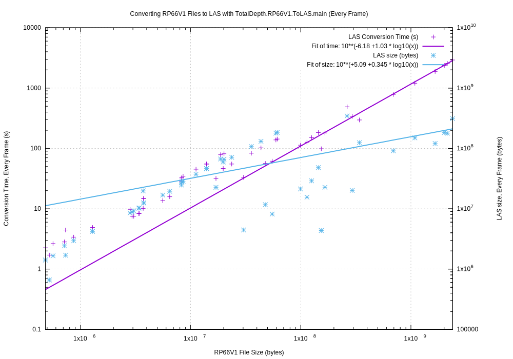
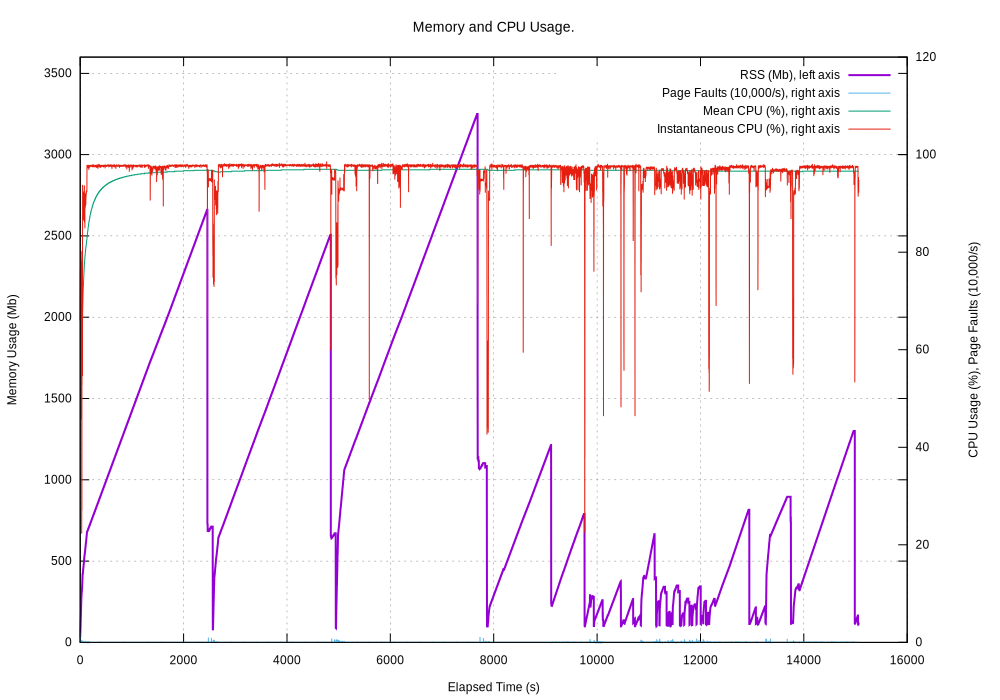
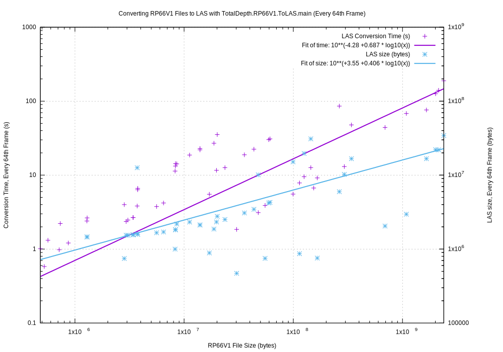
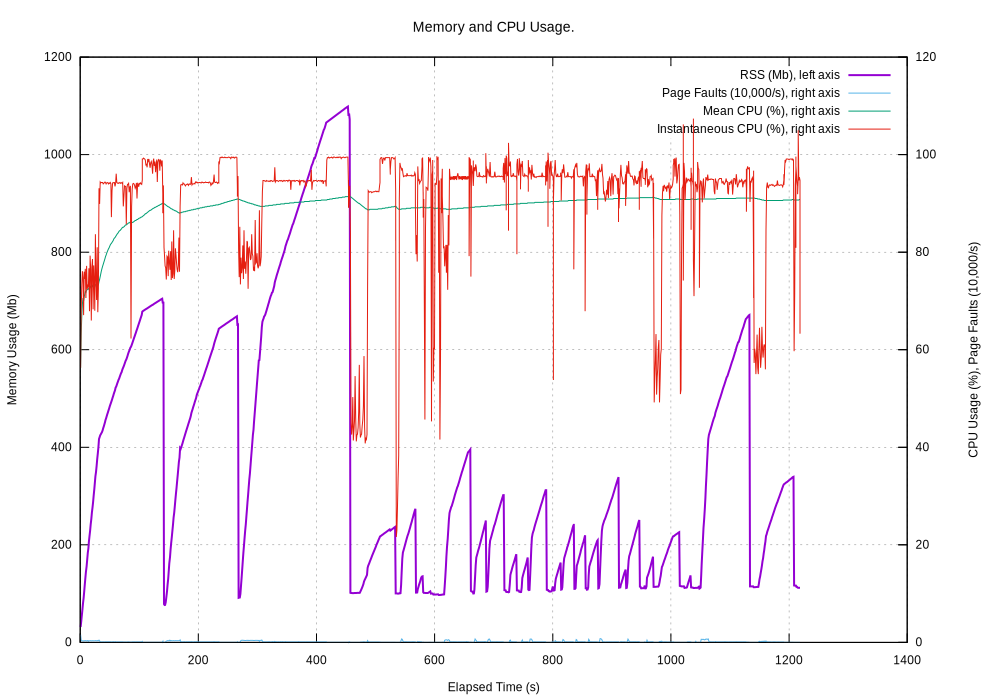
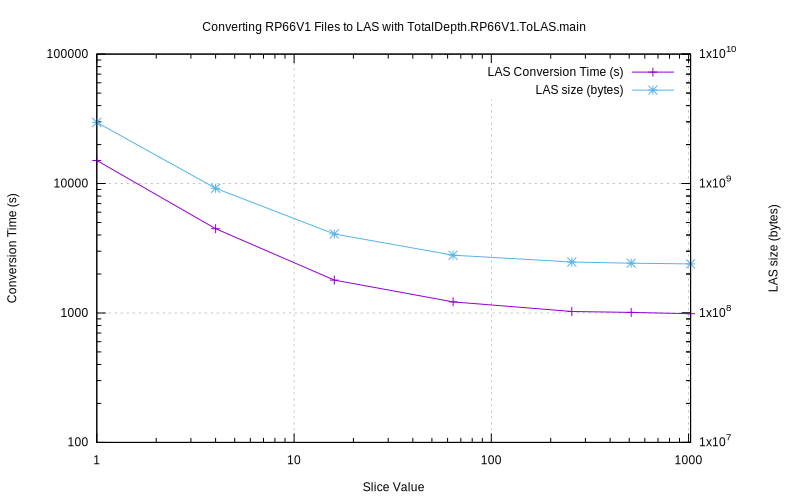

.. moduleauthor:: Paul Ross <apaulross@gmail.com>
.. sectionauthor:: Paul Ross <apaulross@gmail.com>

.. Technical Note on Processing Performance with RP66V1 Files.

.. toctree::
    :maxdepth: 2
   
.. _TotalDepth-tech--RP66V1_processing_perf:

RP66V1 Performance
=============================================

This describes the performance of processing RP66V1 binary files by TotalDepth.

.. note::

    This data refers to version 0.3.0 and may or may not be relavent to the current version, |version|.

.. _TotalDepth-tech-RP66V1_processing_perf_HTML:

Scanning RP66V1 to produce an HTML Summary
---------------------------------------------

The tast set was around 100+ files that ranged in size from 80kb to 4GB totalling 17GB.
The average file size was about 150Mb.
These tests were run on a 2.7 GHz Intel Core i7 machine with 4 cores and hyper-threading.

An archive of RP66V1 can be scanned to provide a summary in HTML by :py:mod:`TotalDepth.RP66V1.ScanHTML`
This produces and HTML page with every EFLR and a summary of all the log frame data.
This is exposed as a command line tool :ref:`tdrp66v1scanhtml <cmd_line_tools_rp66v1_tdrp66v1scanhtml>`.

By default this processes every byte of the file so can take a long time with large files.
Here is the execution time for processing all frames by RP66V1 file size and the size of each HTML file produced.

The asymptotic processing rate is around 800 ms/Mb.

And here is the memory and CPU usage:

Performance Improvements
^^^^^^^^^^^^^^^^^^^^^^^^^^

With very large sets of frame data not every frame needs to be processed.
The option ``--frame-slice`` can be used to sample a subset of frames.
For example:

*  ``--frame-slice=1024,2048,64`` will process every 64th frame from frame 1024 to 2048
* ``--frame-slice=64`` will process only 64 frames of those available (roughly evenly spaced from those available).

Multiprocessing will help proportionally.
In one test case the processing time for the archive fell from 11,000 seconds to 800 seconds using ``--frame-slice=,,64`` and ``--jobs=4`` on a four core machine.
The performance improvement of around x15 was attributed to x5 (frame slicing) and x3 (multiprocessing).

.. _TotalDepth-tech-RP66V1_processing_perf_LAS:

Converting RP66V1 to LAS
----------------------------------

The test set was around 52 files that ranged in size from 400kb to 2.2GB totalling 12GB in all.
The average file size was about 235Mb.
These tests were run on a 2.7 GHz Intel Core i7 machine with 4 cores and hyper-threading.

An Example File
^^^^^^^^^^^^^^^^^^^^^^^^^^

An example file in the tests archive is 2GB in size and contains this Log Pass, the size of the numpy frame to hold all the data is also shown:

=================== =========== =========== =============== ==============================
Frame Array         Channels    Frames      Spacing         Size of Numpy array (bytes)
=================== =========== =========== =============== ==============================
1B (O: 35 C: 0)      12         653880      0.1 inch           31,386,240
2B (O: 35 C: 0)       6         326940      0.2 inch            7,846,560
10B (O: 35 C: 0)     19          65388        1 inch           10,200,528
15B (O: 35 C: 0)     14          43592      1.5 inch            2,441,152
20B (O: 35 C: 0)     83          32694        2 inch           10,462,080
60B (O: 35 C: 0)    204          10899        6 inch        2,294,980,632
120B (O: 35 C: 0)     6           5449       12 inch           11,028,776
=================== =========== =========== =============== ==============================

The 60B Frame Array contains some complex waveform data.
Processing this produces seven LAS files, each LAS file contains all the parameter data and data from a single Frame Array.
Depending on the frame slice the following processing times and LAS sizes were observed.

=============== =========== =================== ===========
Frame Slice     Time (s)    LAS Size (bytes)    ms/Mb
=============== =========== =================== ===========
1               2922        312,604,951         1282
4               855         100,570,379         375
16              303         47,562,819          133.4
64              188         34,309,331          82.8
256             156         30,995,584          68.6
512             152         30,444,007          66.9
1024            148         30,166,341          65.0
=============== =========== =================== ===========

And or course limiting the number of channels has a proportionately similar effect.

Processing the Test Archive to LAS
^^^^^^^^^^^^^^^^^^^^^^^^^^^^^^^^^^^^

Here is the time taken to process each file plotted against the RP66V1 file size.
Also plotted on the right scale is the total size of the LAS file(s).
This is converting every frame to LAS (click to see the original):

    
The asymptotic processing rate is around 1230 ms/Mb.
LAS files (in this test set) below 10Mb tend to be larger than the original, above 100Mb they tend to be around 20% smaller.

And this is the memory usage (click to see the original):

The peaks are caused by the multi-gigabyte Numpy arrays needed for some files.

Sub-sampling
^^^^^^^^^^^^^^^^^^^^^^^^^^

Here is the performance of the same data with ``--frame-slice=64`` that just writes every 64th frame to LAS (click to see the original):

And this is the memory usage (click to see the original):

This is vastly reduced from the every frame case.

Frame slicing can improve the performance dramatically.
Here is the time to process the test archive and the size of the finished LAS archive by slice, for example 64 on the X-axis is write only every 64th frame:

Multi-Processing
^^^^^^^^^^^^^^^^^^^^^^^^^^

Using ``--jobs`` can also improve performance proportionally if you have lots of cores and good I/O.
