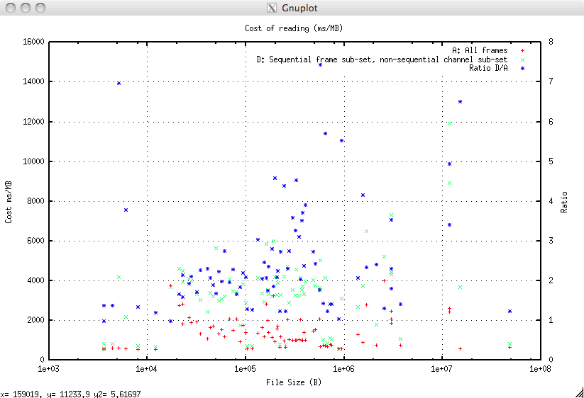

.. moduleauthor:: Paul Ross <apaulross@gmail.com>
.. sectionauthor:: Paul Ross <apaulross@gmail.com>

.. Technical Note on LIS frame read performance.

.. toctree::
    :maxdepth: 2
   
.. _TotalDepth-tech-LIS_read_perf:

####################################
Performance of TotalDepth
####################################

This technical note presents the results of some actual performance tests on TotalDepth.

************************************
Measuring Performance
************************************

This describes some principles used in establishing TotalDepth's performance and setting performance targets.

User's Perception of Performance
====================================

Users only want to pay for what they get and experienced users have a rough idea of the cost of what they ask the software to do. For example most users would regard these a cheap operations, and would not expect them to take much time. If they did the user is likely to regard the application as 'slow':

* Load file
* Show log header
* Plot small section

Most users would regard these more expensive operations and is more likely to accept that they would take more time.:

* Cross correlate multiple curves
* Dipmeter processing
* Deconvolution

Most users are aware of the size of the data set with which the are operating and appreciate that operations on larger data sets take longer time. Users do not appreciate O(N :superscript:`2`) or worse behaviour. We don't like it either [#]_.

TotalDepth measures the cost of operations, in::

	Execution time (ms) 
	-------------------
	Size of input (Mb)

Example of LIS cost
---------------------

Our measure is ms/Mb of input. 1Mb of LIS data is typically 250,000 values, or, to put this in context 200 feet of 10 curves (6" sampling) is 0.015 Mb. So, just as an example, the cost of plotting such data from a 20Mb file *might* work out as:

============================    =============   ==============  ================    ===================
Operation                       Cost (ms/Mb)    Data Size (Mb)  User's Time (ms)     Notes
============================    =============   ==============  ================    ===================
Index a 20Mb file               12              20              240                 One-off exercise
Reading 200 feet, 10 curves     1500            0.015            22
Plotting what has been read     4000            0.015            60
**Total**                       -               -               **322**
============================    =============   ==============  ================    ===================

The rest of this tech note describes the performance of reading LIS files in these ms/Mb terms.

************************************
Actual LIS Performance
************************************

Actual performance results of some LIS file operations.

File Read Cost
======================

The measure here is low level reading and conversion from binary words to internal number formats. Three operations are being measured:

* Raw read speed of bytes.
* Above, and converting to internal integers and floats.
* Above and converting from Rep Code 68 to an internal float.

The input data was about 100 binary files with random data of around 100 Mb in total.

The x-axis of the graph below is the buffer length, in other words how much data is swallowed in a single atomic read.

.. image:: images/ReadUnpackRc68.png

Raw File Read
----------------

The 'Read all' graph shows the cost of reading bytes at different buffer sizes from a file and discarding it. This is the baseline and represents the crude storage access time. Large buffer sizes achieve <1 ms/Mb (1 Gb/s).

Raw File seek()
----------------

The 'Seek all' graph shows the cost of traversing a file using seek() at different seek lengths. No data is read. Combined with the read information this can be used to estimate the minimum time to make a series of read/seek operations.

Using the ``struct`` module
--------------------------------------------------------------------

The "Read int (compiled)" and "Read float (compiled)" data shows the cost of reading bytes into a buffer and then converting them to a list of integers and floats using the ``struct`` module (the type declaration is compiled). They show an asymptotic cost, in addition to the read cost, of 8 and 3 ms/Mb respectively. This shows very good performance for reading builtin types with the struct module. As most RP66 types are builtins (or types supported by the struct module) then the struct module should be used for RP66.

It is slightly surprising that reading an integer is slower than reading a floating point number.

Reading Rep Code 68
----------------------------------

This establishes the cost of converting a bytes object in Representation Code 68 to a internal floating point value.

The cost of using Python code and Cython code is examined and in each case the the total cost or read+convert is presented and then the integer ``struct`` read cost (above) is subtracted to get the conversion cost.

Python
^^^^^^^^^^^^^^^^^^^^^^

The data sets "Read Rep Code 68 (Python)" and "Convert to Rep Code 68 (Python)" plots to the cost of reading bytes and converting them to Representation code 68, the latter curve has the read cost subtracted (from above) so it represents merely the conversion cost of in-memory from bytes to Rep Code 68. This is asymptotic to around 270 ms/Mb.

Cython
^^^^^^^^^^^^^^^^^^^^^^

The data sets "Read Rep Code 68 (Cython)" and "Convert to Rep Code 68 (Cython)" is as immediately above but using Cython code rather than Python code. This is asymptotic to around 72 ms/Mb. This is significantly longer than using the struct module to interpret a IEEE float so it could be that some improvement could be made with a pure C implementation.

Cython vs Python
---------------------------------------------------------------------

The "Cython/Python cost (right axis)" plots the ratio of converting Rep Code 68 with Python and Cython. The Cython code takes 0.27 of the cost of the Python code. Well worth it.

Frame Read Cost
==================================

The operation being timed here is, given a LIS file index, read a certain set of frame data then convert each value to an internal floating point number and then populate the internal FrameSet object. This is a basic operation before doing any plotting, channel editing, recalibration etc. The amount of data read is the cumulative size in LIS bytes of all the values read from the file. 250,000 values would constitute typically 1Mb of LIS data.

A number of different methods were use to read the LIS data:

* Method A: All frames all channels. Here indexing provides no optimisation as it is a simple sequential read operation of everything.
* Method C: A sequential subset of the frames and a sequential subset of the channels. This requires a logical seek operation to the start of the frames then, within each frame a seek then read then seek operation.
* Method D: A sequential subset of the frames and a non-sequential subset of the channels. This requires a logical seek operation to the start of the frames then, within each frame multiple seek/read operations.
* Method E: A non-sequential subset of the frames and a non-sequential subset of the channels. This requires a set of logical seek/read operations to each frame then, within each frame multiple seek/read operations.

Indexing can provide an optimisation for methods C-E as it hugely reduces the amount of read operations to that just sufficient for the required frames and channels. The important measure is that the cost of indexing, computing and executing seek/read operations does not outweigh the reduction in data read.

For example if a frame has 40 channels and only 5 are required then, if the cost per byte stays the same then the user sees a 8 fold speed improvement. If the cost per byte doubles then the user still sees a 4 fold speed improvement. If the cost per byte rises 8 fold there is no advantage over doing a sequential read of all channels. Beyond an eight fold rise in indexing cost the user sees a performance *reduction*.

A: All Frames, all Channels
-------------------------------------

This is the baseline, indexing plays no part as this is a straightforward sequential read operation of every channel in every frame.

.. image:: images/ReadCost_A.png

Although there is quite a spread there is, gratifyingly, no obvious trend for the cost to increase as the file size does which would indicate worse than O(N) behaviour. The behaviour is clearly O(N). The cost in ms/Mb is:

=======	===============
A:		Cost ms/Mb
=======	===============
Minimum	541.8
Mean	1446.9
Maximum	4003.3
=======	===============

C: Adjacent Frames and Channels
-----------------------------------------

This is taking a random, but sequential, subset of the frames and a random, but sequential, subset of the channels. This requires the indexer to do a logical seek operation to the start of the frames then, within each frame a seek then read then seek operation.

The results are plotted compared to the baseline and the ratio of the cost of C relative to the cost of A for each file is plotted on the right hand axis.

.. image:: images/ReadCost_A-C.png

The cost in ms/Mb is:

==========  =============== ==============  ==========
Value       A: Cost ms/Mb   C: Cost ms/Mb   Ratio C/A
==========  =============== ==============  ==========
Minimum     541.8           545.7           0.57
**Mean**    **1446.9**      **1561.3**      **1.13**
Maximum     4003.3          4485.8          4.25
==========  =============== ==============  ==========

This means that a small increase in cost (13%) is the price of a hugely reduced data set.

D: Adjacent Frames, any Channels
--------------------------------------------------

This is taking a random, but sequential, subset of the frames and a random, but non-sequential, subset of the channels. This requires the indexer to do a logical seek operation to the start of the frames then, within each frame multiple seek/read operations.

This is highly representative of the indexing operation performed when plotting, say, any 200 foot section of a number of selected channels.

The results are plotted compared to the baseline and the ratio of the cost of D relative to the cost of A for each file is plotted on the right hand axis.

The cost in ms/Mb is:

==========  =============== ==============  ==========
Value       A: Cost ms/Mb   D: Cost ms/Mb   Ratio D/A
==========  =============== ==============  ==========
Minimum     541.8           581.8           0.98
**Mean**    **1446.9**      **3410.5**      **2.55**
Maximum     4003.3          11928.6         7.44
==========  =============== ==============  ==========

It should be noted that this test is deliberately harsh in that non-sequential channels are always chosen. If some of the channels are adjacent then the cost reduces, for those channels, more towards C (typically half the cost of D).

Evens so provided the number of channels of interest is less than 40% of the total indexing this way provides a real speed improvement. The important point being this may not produce an improvement (and may actually be slower) for small frame sizes; they are not the problem precisely because they are small. For the seriously problematic large frame sizes then indexing will always be faster, often dramatically so.

E: Any Frames, any Channels
--------------------------------------------------

This is taking a random, non-sequential, subset of the frames and a random, but non-sequential, subset of the channels. This requires the indexer to perform a set of logical seek/read operations to each frame then, within each frame multiple seek/read operations.

Essentially this is the same as test D but skipping intermediate frames.

The results are plotted compared to the baseline and the ratio of the cost of E relative to the cost of A for each file is plotted on the right hand axis.

.. image:: images/ReadCost_A-E.png

The cost in ms/Mb is:

==========  =============== ==============  ==========
Value       A: Cost ms/Mb   E: Cost ms/Mb   Ratio E/A
==========  =============== ==============  ==========
Minimum     541.8           619.9           1.03
**Mean**    **1446.9**      **3491.7**      **2.57**
Maximum     4003.3          13552.5         7.98
==========  =============== ==============  ==========

There is a very slight (around 1-5%) additional cost over D but the huge benefit is being able to skip intermediate frames. This means that a low resolution plot (say 1:500) of a high resolution log (say sampling every 1.2 inches) could read every fifth frame (six inch sampling) and that would be plotted every 0.012" (say 1 pixel) as a speedup of almost 500%.

All Measurements
--------------------------------------------------

For the sake of completeness, here are all the results:

.. image:: images/ReadCost.png

.. _TotalDepth-tech-perf_improve:

Performance Improvements
=================================

The low level performance of TotalDepth is pretty good. FrameSet performance is satisfactory. Further improvement is certain for :ref:`TotalDepth-tech-indexing-perf_improve` once the existing C code (in another project) is integrated into this one.

Populating the frame is a costly exercise and the current solution takes this path::

    File bytes -> Cython convert to C double -> convert to Python float -> insert into a numpy array.

All this boxing and unboxing is expensive and a faster (but with more code complexity) is to populate the numpy array directly so this all happens in C code::

    File bytes -> Convert to C double -> copy directly into numpy memory space

This should provide a great speedup.

The SVG creation is also worth looking at.

.. rubric:: Footnotes

.. [#] It is very easy for software developers to fail to see this kind of behaviour. For example if the time for an operation is: a + b * N + c * N :superscript:`2` and c << b. If the software test suit tests an insufficiently small size of N then it appears that the operation is O(N). Along comes a user with a large data set and they see O(N :superscript:`2`) behaviour. This (or worse) is quite commonly observed in many software products.
